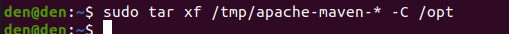

# Instalación de Maven en Ubuntu 20.04
**Índice**

1. [Introducción](#1)
2. [¿Cómo instalar Maven en nuestro SO Ubuntu?](#2)
3. [Configuración de las variables de entorno](#3)

## Introducción<a name="1"></a>

Es una herramienta de software utilizada para la gestión de proyectos que estan basados en el lenguaje Java, existen otros similares como Ant. También ayuda en el proceso de copilación y construcción de la aplicación o programa que se basa en formatos tipo XML o también por sus siglas Extensible Markup Language.

## 1. ¿Cómo instalar Maven en nuestro SO Ubuntu?<a name="2"></a>
Primeramente lo que vamos hacer es actualizar los repositorios del sistema con el siguiente comando:
```
$ sudo apt-get update
```
<div align="center">
 

 
</div>

Una vez esto se haya realizado tenemos dos maneras de instalar Maven en nuestro SO, una de ellas es haciendo desde `apt` y otra es descargando directamente Apache Maven desde la web de apache.

Utilizaremos el siguiente comandopara poder descargarlo y almacenarlo en el directorio `/tmp`:

```
wget https://www.apache.org/dist/maven/maven-3/3.8.2/binaries/apache-maven-3.8.2-bin.tar.gz -P /tmp
```
<div align="center">
 

 
</div>

Cuando la descarga se haya completado vamos a extraer el archivo en un directorio distinto, en este caso sera el directorio `/opt`, por lo tanto usaremos el siguiente comando para hacer este paso:

```
sudo tar xf /tmp/apache-maven-* -C /opt
```
<div align="center">
 

 
</div>

La terminal no nos dará ninguna respuesta cuando se haya completado o durante el proceso, ya que no le hemos indicado que sea verbose.

Seguidamente creamos un enlace simbólico que apunte al directorio donde se encuentra instalado Maven.

```
sudo ln -s /opt/apache-maven-3.8.2 /opt/maven
```
<div align="center">
 

 
</div>

## 2. Configuración de las variables de entorno<a name="3"></a>

Necesitaremos establecerlas variables de entorno de Maven, para ello crearemos un nuevo archivo llamado `maven.sh` que servirá como un script para ejecutar lo que vamos a establecer en las variables en el directorio `/ect/profile.d`.

```
sudo nano /etc/profile.d/maven.sh
```
<div align="center">
 

 
</div>

Dentro del fichero estableceremos las siguientes líneas:

```
export JAVA_HOME=/usr/lib/jvm/IMPORTANTE-RESPETAR-LA-VERSION-DE-JAVA-INSTALADA
 export M2_HOME=/opt/maven
 export MAVEN_HOME=/opt/maven
 export PATH=${M2_HOME}/bin:${PATH}
```
<div align="center">
 

 
</div>

Guardaremos con `ctrl` + `x`, nos pedirá si queremos guardar los cambios y le daremos a la `s` y a `enter`.

Hay que hacer que el script que acabamos de crear sea ejecutable, por lo tanto hay que cambiar los permisos del archivo con el comando `chmod` y darle permisos de ejecución de la siguietne manera:

```
 sudo chmod +x /etc/profile.d/maven.sh
```

Tenemos que especificar la ruta de donde se encuentra nuestro script, que es donde utilizamos el editor de texto `nano`, entonces la ruta sería `/etc/profile.d/nombre-del-script`.

<div align="center">
 

 
</div>

Finalmente cargamos las variables de entorno que acabmos de especificar para que estas funcionen correctamente con el comando `source`, donde la ruta que vamos a utilizar es la misma que el paso anterior de donde se encuentra nuestro script.

```
 source /etc/profile.d/maven.sh
```

<div align="center">
 

 
</div>

Para comprobar que todo lo que hemos realizado sea correcto y este funcionando, visualizaremos la verson del Maven y debrá de coincidir con la que hemos instalado.

<div align="center">
 

 
</div>
